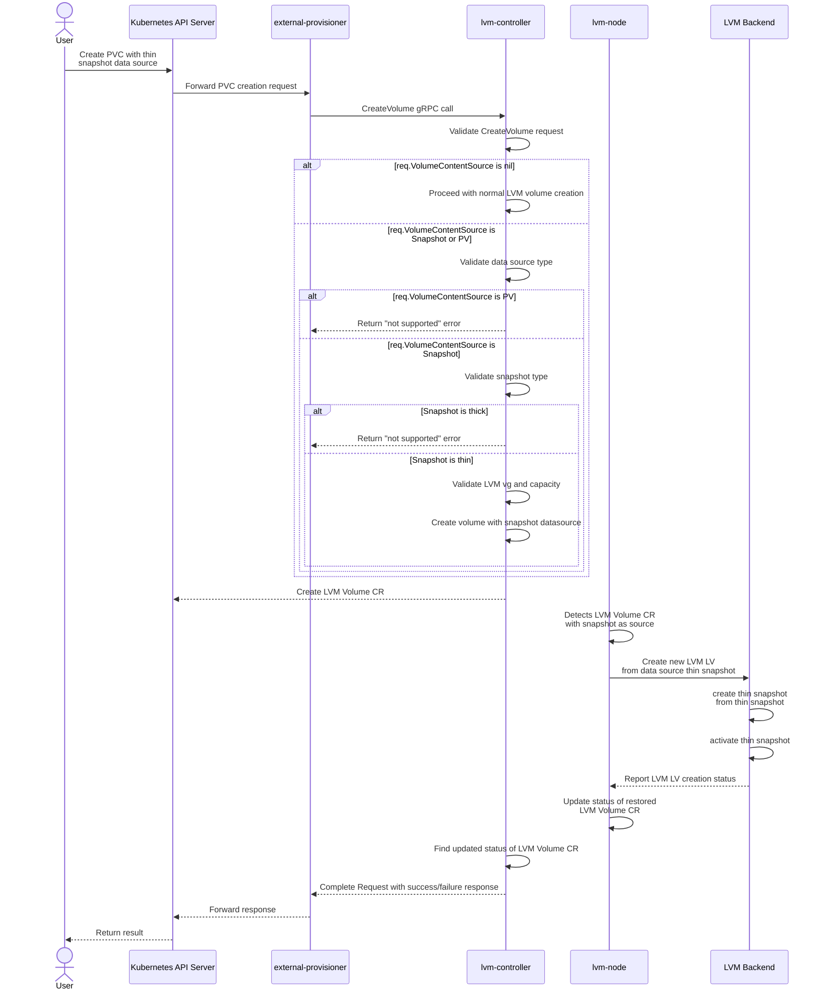

# Add Snapshot Restore Feature to OpenEBS LVM
> Warning: Restoring from a snapshot is available exclusively for thinly provisioned volume snapshots.

## Table of Contents

1. [Overview](#overview)
2. [Motivation](#motivation)
3. [Terminology](#terminology)
4. [Goals](#goals)
5. [Non-Goals](#non-goals)
6. [Proposal](#proposal)
7. [User Stories](#user-stories)
8. [Implementation Details](#implementation-details)
9. [Testing](#testing)

## Overview

This OEP proposes adding Snapshot Restore feature to OpenEBS LVM.
This feature would enable users to create restore from thin snapshot LV (LVM Logical Volume).

## Motivation

OpenEBS LVM supports snapshots, but restoring from them is not supported. This limitation creates challenges when attempting to recover data from snapshots.

## Terminology

- `LV`: LVM Logical Volume
- `VG`: LVM volume group
- `lvm-node`: OpenEBS LVM node plugin
- `lvm-controller`: OpenEBS LVM controller plugin
- `PVC`: k8s PersistentVolumeClaim
- `CR`: Custeom Resource

## Goals

- Enable users to create restore from snapshot of thinly provisioned volume.

## Non-Goals

- Restoring from thick snapshot LVs.

## Proposal

For restoring from snapshot of thin-provisioned volume, a new snapshot LV is created from an existing thin snapshot LV. Since LVM snapshots are writable, these can be exposed as new PVCs without losing the original snapshot’s identity. This allows multiple restores from the same snapshot, resulting in multiple independent copies. The restored thin snapshot volume is activated as Read-Write and presented to Kubernetes as PersistentVolume object.

- Add two new fields to the LVM Snapshot CR: **`thinSnapshot`** and **`snapOriginVolumeCapacity`**.
    - **`thinSnapshot`**: Indicates whether the snapshot was created from a thin-provisioned volume.  
    - **`snapOriginVolumeCapacity`**: Records the capacity of the origin volume at the time the snapshot was taken.
- Add a new field **`source`** to the LVM Volume CR. It defines the data source for the volume.
    - Can be a **snapshot**  
    - Or an **existing volume**

## User Stories

### Story 1

As a user, I want to create a `PersistentVolumeClaim` from a `VolumeSnapshot` of a thin-provisioned volume.

## Implementation Details

### Design

- With LVM Thin Pools, snapshot of snapshot can be writable and used as lightweight clones.
- Common blocks in nested snapshots are stored once in the thin pool, so snapshot chains can grow without limits or performance loss.
- To restore a PVC from LVM snapshot of thin-provisoned volume, a new thin-provisioned snapshot is created from the existing snapshot. Since LVM snapshots are inherently writable, this snapshot can be exposed to the user as a volume for a new PVC.
- The identity of the original LVM snapshot remains intact.
- Restored thin snapshot volumes are activated in Read-Write mode and presented to applications as PersistentVolume objects.
- Writes to restored LV consume new blocks and Original snapshot remains point-in-time and read-only from Kubernetes perspective. This ensures multiple independent PVCs can be provisioned from a single snapshot safely.

> Note: By default, LVM snapshots are writable. However, the snapshots currently created by the OpenEBS LVM provisioner are read-only. Only snapshots generated during restore operations by the LVM backend are made writable.

### Workflow

1. User create PVC with data source as thin snapshot.
2. The **external-provisioner** kubernetes sidecar sends a CreateVolume gRPC call to OpenEBS LVM CSI driver.
3. This **CreateVolume** request containing a dataSource is received by the lvm-controller.
4. From the **CreateVolume** request, validate volume creation request
    - If **req.VolumeContentSource** is nil, proceed as normal OpenEBS LVM volume creation.
    - On the other hand, the Volume creation request might have a data source as either a Snapshot or Persistent Volume.
    - Validate request whether snapshot is thin or thick , if snapshot is thick then return not supported error.
    - Validate LVM vg and capacity of CreateVolume request.
    - If the source is another volume (PVC/PV), then return not supported error.
    - If data source is snapshot then create volume with datasource as snapshot.
5. OpenEBS LVM controller creates lvm volume CR with snapshot name, node name, vgpattern,volGroup, capacity, thinProvision values.
6. **lvm-node** on the target node finds the earlier created restore volume lvmvolume CR with snapshot as source.
7. **lvm-node** issues a volume create request to create a new thin snapshot LV from the source thin snapshot LV
    - Backend (LVM) could internally:
        - Creates thin snapshot of snapshot
            - ```lvcreate -s -n openebs-lvm-restore-lv lvmvg/openebs-lvm-thin-snapshot```
        - Activates above snapshot with Read-Write permissions which will be restored LV
            - ```lvchange -kn -ay lvmvg/openebs-lvm-restore-lv```
8. **lvm-node** updates the status of restored LVM Volume CR
9. **lvm-controller** finds the updated status of restored LVM Volume CR
10. **lvm-controller** complete create_volume request with success (or failure)

#### Workflow Diagram

<br>



<br>

### OpenEBS lvmsnapshot CR

```yaml
apiVersion: local.openebs.io/v1alpha1
kind: LVMSnapshot
metadata:
  name: snapshot-0e1967eb-471d-4a7e-93b1-ba92d53c7a2a # lvm snapshot cr name
  namespace: openebs
spec:
  ownerNodeID: node-0-397958
  # origin volume capacity at the time of snapshot
  sourceVolumeSize: "2147483648"
  # 'thinSnapshot' specifies type of snapshot, this field will be yes 
  # if snapshot is of thin-provisoned volume else it will be no
  thinSnapshot: "yes"
  volGroup: lvmvg
status:
  state: Ready
```

### Restore from Snapshot

***restore-pvc.yaml***
```yaml
kind: PersistentVolumeClaim
apiVersion: v1
metadata:
  name: pvs-restore-from-snapshot
spec:
  storageClassName: restore-sc
  dataSource:
    name: lvm-thin-snapshot # name of the thin snapshot
    kind: VolumeSnapshot
    apiGroup: snapshot.storage.k8s.io
  accessModes:
    - ReadWriteOnce
  resources:
    requests:
      storage: 2Gi # capacity of restored PVC
```

### OpeneEBS lvmvolume CR for restore

```yaml
apiVersion: local.openebs.io/v1alpha1
kind: LVMVolume
metadata:
  name: pvc-97e44bbf-e916-4fe4-bca0-04e5aabcba4e
  namespace: openebs
spec:
  capacity: "2147483648"
  ownerNodeID: node-0-397958
  source: snapshot-0e1967eb-471d-4a7e-93b1-ba92d53c7a2a # lvm snapshot CR name
  volGroup: lvmvg
status:
  state: Ready
```

### Risks and Mitigations

- Enable **thin_pool_autoextend_threshold** and **thin_pool_autoextend_percent** in **lvm.conf**. Prevents write failures when thin pool fills. Ensure Volume Group (VG) has spare capacity, otherwise auto-extend won’t help.


## Testing

- Restore from a thin snapshot.  
- Restore from a thick snapshot — operation should fail.  
- Restore using a non-existent snapshot — operation should fail.  
- Restore from a snapshot belonging to a different volume group (VG) — operation should fail.  
- Expansion of restored volume created from a thin snapshot should succeed.  
- Attempt to create a restored PVC with capacity greater than the source volume at snapshot time — operation should fail.  
- Attempt to create a restored PVC with capacity smaller than the source volume at snapshot time — operation should fail.  
- Deletion of data source snapshot after performing a restore should succeed.
- Restore from snapshot as a thick volume - operation should fail.
