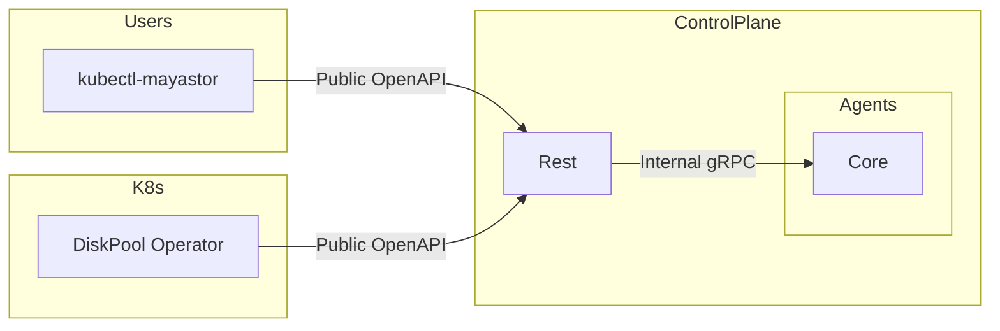

# Cordon Mayastor Pools

## Table of Contents

TODO

## Summary

This proposal aims to extend the existing Mayastor Cordon commands (currently applicable to nodes) to Pools.

## Motivation

The motivation behind this proposal is, as it says on the tin, is the need to cordon a pool when creating new resources on it is not desirable. Some examples of this are:

* When we want to drain a pool
Please note however, that this will require an OEP on its own
* When the state of a pool is dubious, and we might not want to create further replicas on it

### Goals

Extend cordon operations to pools.

### Non-Goals

Whilst cordoning a pool is a pre-requisite for draining a pool, the draining of the pool requires its own OEP and is therefore not a goal here. \
The DiskPool CR is responsible for creating and deleting a Mayastor Pool. Currently there's no mechanism to sync up between mayastor pool labels
and diskpool labels. The goal of this OEP is not to solve this issue, and therefore it will not address any CR<->ControlPlane synchronization.

## Proposal

Add a new resource (pool) to the existing cordon and uncordon kubectl-mayastor plugin subcommands:

1. kubectl-mayastor cordon pool
2. kubectl-mayastor uncordon pool

### User Stories

#### Story 1

As a user, I don't want any more replicas to be created on a given pool. In other words, I want to cordon this pool. \
I also reserve the option to uncordon it in the future.

#### Story 2

As a user, I want to delete a pool which is currently hosting replicas for a few volumes. There's no such functionality yet, but I know I can achieve
this by:

1. Cordon the pool
2. Scale volumes with replicas on said pool by +1 replica
3. Wait until the rebuilds complete
4. Scale the volumes back down by -1 replica

### Implementation Details/Notes/Constraints

A mayastor pool may host 3 different resources:

1. Replicas
2. Snapshots
3. Clones

By default we can constrain replicas and clones, but allow for snapshots.

The proposal is to extend the pool services with the cordoning operations:

1. Cordon a pool
2. Uncordon a pool

<br>
Let's recap the existing connections:

<br>



<br>

Adding new cordoning operations requires us to modify both the `Internal gRPC` and the `public OpenAPI`.
The DiskPool operator is responsible for managing the `DiskPool CRs` but there's currently no mechanism by which changes to the DiskPool are synced across the Control-Plane and the CR definition of the pool. \
As such we're proposing that the CR reflects only the cordon state of the pool, rather than being capable of driving it. At least for the time being.

#### Internal gRPC

Add cordon handlers to the [PoolGrpc](https://github.com/openebs/mayastor-control-plane/blob/2fee47f970bc73c4e5ddb83a1b390d5ab7074b4b/control-plane/grpc/proto/v1/pool/pool.proto#L175).
Example:

```protobuf
message CordonPoolRequest {
  optional string node_id = 1;
  string pool_id = 2;
  bool replicas = 3;
  bool snapshots = 4;
  bool restores = 5;
  bool imports = 6;
}
message CordonPoolReply {
  oneof reply {
    Pool pool = 1;
    common.ReplyError error = 2;
  }
}

message CordonedState {
  // New replicas can't be created
  bool replicas = 1;
  // New snapshots can't be created
  bool snapshots = 2;
  // New restores can't be created
  bool restores = 3;
  // Pool is not to be imported
  bool imports = 4;
}

service PoolGrpc {
    rpc CordonPool (CordonPoolRequest) returns (CordonPoolReply) {}
    rpc UncordonPool (CordonPoolRequest) returns (CordonPoolReply) {}
}
```

#### Public OpenAPI

```openapi
paths:
  '/pools/{pool_id}/cordon':
    put:
      tags:
        - Pools
      operationId: put_pool_cordon
      parameters:
        - in: path
          name: pool_id
          required: true
          schema:
            type: string
      requestBody:
        content:
          application/json:
            schema:
              $ref: '#/components/schemas/PoolCordonReq'
      responses:
        '200':
          description: OK
          content:
            application/json:
              schema:
                $ref: '#/components/schemas/Pool'
        '4XX':
          $ref: '#/components/responses/ClientError'
        '5XX':
          $ref: '#/components/responses/ServerError'
      security:
        - JWT: [ ]
    delete:
      tags:
        - Pools
      operationId: del_pool_cordon
      parameters:
        - in: path
          name: pool_id
          required: true
          schema:
            type: string
      requestBody:
        content:
          application/json:
            schema:
              $ref: '#/components/schemas/PoolCordonReq'
      responses:
        '200':
          description: OK
          content:
            application/json:
              schema:
                $ref: '#/components/schemas/Pool'
        '4XX':
          $ref: '#/components/responses/ClientError'
        '5XX':
          $ref: '#/components/responses/ServerError'
      security:
        - JWT: [ ]
components:
  schemas:
    PoolCordonReq:
      description: Cordon or uncordon the following resources
      type: object
      properties:
        replicas:
          type: boolean
        snapshots:
          type: boolean
        restores:
          type: boolean
      required:
        - replicas
        - snapshots
        - restores
        - imports
```

#### Kubectl Plugin

Add new subcommands to cordon with the pool resource.

### Test Plan

In order to test this feature we need a scenario where we'd make use the pool which we are cordoning.
If there are multiple options available, what if the scheduler always picks the other pools and we never exercise the cordoning logic for example.

Other than this scenario, there's probably nothing specific we need to test around this, other than
ensuring the cordon and uncordon operations are in fact working and affect the scheduling.

#### Behaviour specification

```gherkin
Feature: Pool Cordoning

  Background:
    Given multiple uncordoned nodes

  Scenario: Cordoning a pool
    Given an uncordoned pool
    When we issue a cordon command
    Then the command will succeed
    And new resources cannot be scheduled on the cordoned pool

  Scenario Outline: Cordoning a pool with resources
    Given an uncordoned pool with test resources
    When we issue a cordon command with resource <resource>
    Then the command will succeed
    And new <resource> resources cannot be scheduled on the cordoned pool
    But other resources can
    Examples:
      | resource  |
      | replicas  |
      | snapshots |
      | restores  |

  Scenario: Cordoning a cordoned pool
    Given a cordoned pool
    When we issue a cordon command with additional constraints
    Then the command will succeed
    And the pool should remain cordoned
    And new resources cannot be scheduled on the cordoned pool

  Scenario: Uncordoning a pool
    Given a cordoned pool
    When we issue an uncordon command with the cordoned resources
    Then the command will succeed
    And new resources can be scheduled on the cordoned pool

  Scenario: Deleting resources on a cordoned pool
    Given a cordoned pool with resources
    When we attempt to delete resources on the cordoned pool
    Then the resources should be deleted

  Scenario: Restarting a cordoned pool
    Given a cordoned pool with resources
    When the cordoned pool is restarted
    Then the pool should be imported successfully
    And all pool resources should be Online

  Scenario: No replica rebuild due to pool cordon
    Given a published volume with multiple replicas
    And a cordoned pool, otherwise schedulable for the volume
    When the volume becomes degraded
    And there are insufficient uncordoned pools to accommodate new replicas
    Then the volume will remain in a degraded state
    When the pool is uncordoned
    Then the volume shall eventually rebuild become healthy

  Scenario: No replica count increase due to pool cordon
    Given a published volume with multiple replicas
    And a cordoned pool, otherwise schedulable for the volume
    When we attempt to increase the replica count
    And there are insufficient uncordoned pools to accommodate new replicas
    Then the request should fail with insufficient storage
    When the pool is uncordoned
    And we attempt to increase the replica count
    Then a new set-replica request should succeed

  Scenario: Pool should be cordoned if there is at least one cordon applied
    Given a cordoned pool with multiple cordon resources
    When we issue an uncordon command without all resources
    Then the command will succeed
    And the pool should remain cordoned

  Scenario: Pool should be uncordoned when all cordons have been removed
    Given a cordoned pool with multiple cordon resources
    When we issue an uncordon command with all resources
    Then the command will succeed
    And the pool should be uncordoned
```

### Risks and Mitigations

TODO

#### Mitigations

TODO

## Graduation Criteria

## Implementation History

* the `Summary` and `Motivation` sections being merged signaling owner acceptance

## Drawbacks [optional]

We're still not solving the issue of synchronizing `DiskPool CR` and `ControlPlane Pool` labels.

## Alternatives [optional]

It may be possible to manually patch the pool labels in the persistent store in such way which would prevent volumes from being created. This may require patching the volumes as well. \
We may suggest this as a WA sometimes but this is not a great solution.
