# RWX Block Volume Support in Mayastor for KubeVirt

 

## Table of Contents

- [🎯 Summary](#-summary)
- [📌 Motivation](#-motivation)
  - [🧱 Goals](#-goals)
  - [🚫 Non-Goals](#-non-goals)
- [🧵 Proposal](#-proposal)
  - [📚 User Stories](#-user-stories)
    - [🧑‍💻 Story 1](#-story-1)
    - [🧑‍💻 Story 2](#-story-2)
  - [🛠️ Implementation Details/Notes/Constraints](#️-implementation-detailsnotesconstraints)
    - [Public OpenAPI](#public-openapi)
    - [Internal gRPC](#internal-grpc)
    - [Kubectl Plugin](#kubectl-plugin)
  - [Test Plan](#test-plan)
    - [Behaviour specification](#behaviour-specification)
  - [Risks and Mitigations](#risks-and-mitigations)
    - [Mitigations](#mitigations)
- [Graduation Criteria](#graduation-criteria)
- [Implementation History](#implementation-history)
- [Drawbacks \[optional\]](#drawbacks-optional)
- [Alternatives \[optional\]](#alternatives-optional)

 

## 🎯 Summary

This proposal introduces RWX (ReadWriteMany) block volume support in Mayastor to enable "shared" block storage for KubeVirt virtual machines. The enhancement aims to support VM migration across nodes, improving HA, maintenance, etc

 

## 📌 Motivation

Our users' KubeVirt VMs currently rely on PVCs with `ReadWriteOnce` access mode, limiting their ability to share block devices across nodes.
Kubevirt requires PVCs with `ReadWriteMany` access mode to enable its [live migration](https://kubevirt.io/user-guide/compute/live_migration/).

 

### 🧱 Goals

- Implement RWX block volume support in Mayastor.
- Ensure compatibility with KubeVirt VM disk attachments.
- Provide CSI-compliant RWX semantics for block volumes.
- Support Persistent Reservations (optional) for fencing.

 

### 🚫 Non-Goals

- RWX support for filesystem volumes.
- RWX support for non-KubeVirt workloads.
- VM-level fencing or quorum management (we don't want to share, but rather to switch!).

 

## 🧵 Proposal

As per my understanding, KubeVirt itself handles the flushing and switching of the storage to the new node, which means we don't even have to implement reservations.
The CSI spec allows for many access modes, example:

- ***MULTI_NODE_SINGLE_WRITER***
  A volume can be published at multiple nodes simultaneously. Only one of the node can be used as read/write. The rest will be readonly.
- ***MULTI_NODE_MULTI_WRITER***
  A volume can be published as read/write at multiple nodes simultaneously.

However, KubeVirt is consuming K8s volumes, and there's no such thing as `ReadWriteOneReadMany`, only `ReadWriteMany`. As such, we have to support the `ReadWriteMany` for Block volumes by implementing the `MultiNodeMultiWriter` capability.

Mayastor currently supports only `NVMe-oF` at the top, and this is suitable for exposing a volume to multiple nodes at a time.
In addition, the `nvme` protocol itself does support reservations as a mechanism for:

- Controlling access to shared namespaces
- Preventing conflicts between hosts
- Ensuring data integrity and consistency

Considering this OEP is targeting KubeVirt specifically, then we may skip implementing access control through the reservations, on the premise that KubeVirt is already taking care of this by itself.

 

### 📚 User Stories

#### 🧑‍💻 Story 1

As a user, I want to live-migrate my KubeVirt VMs from one node to another. I accept that I must use block volumes in order to achieve this.

#### 🧑‍💻 Story 2

As a user, I need live-migration to be tolerant to volume-target failovers.

 

### 🛠️ Implementation Details/Notes/Constraints

Following a top-down approach, here are the required modifications:

1. Extend Mayastor CSI to advertise `MultiNodeMultiWriter`, but only for block mode volumes.
   1. this means we'd reject it for fs volumes, since that cannot possibly work!
2. Core agent must now accept publishes, even if the volume is already published, but for a different node
3. Core agent must collate all valid initiator nqns when building the access control list for the NVMe-oF target.
4. Ha/Cluster agent must track volume's failed nqn paths on a per-node basis.
5. Ha/Cluster agent must ensure atomic `RepublishVolume` per volume
   1. For every successful `RepublishVolume` all nodes should attempt to reuse the newly yielded `uri`.
   2. Repeated `RepublishVolume` per node is fine so long as `reuse_existing` is true.

 

Here's a depiction on how the connected nodes would look like:

 

Optionally, we may modify the csi-node to take the reservations when connecting, though this would have to be carefully considered and I'm not planning on doing it for this.

Here's how the workflow would look like:

```mermaid
sequenceDiagram
  Actor CO
  participant CSI Controller

  participant PublicApi
  participant Core
  participant IoEngine-1

  CO ->>+ CSI Controller: Publish Volume to Node-1
  CSI Controller ->> PublicApi: Publish Volume to Node-1
  PublicApi ->>+ Core: Publish Volume to Node-1
  alt First publishes imples volume target creation
  Core ->> IoEngine-1: Create Volume Target (Nexus)
  IoEngine-1 -->> Core: 
  Core ->> IoEngine-1: Add Node-1 as allowed client
  IoEngine-1 -->> Core: 
  end
  Core -->>- PublicApi: 
  PublicApi -->> CSI Controller: 
  CSI Controller -->>- CO: 

  CO ->>+ CSI Controller: Publish Volume to Node-2
  Note right of CSI Controller: Ensure<br> mode is MultiNodeMultiWriter<br>and access type is Block
  CSI Controller ->> PublicApi: Publish Volume to Node-2
  PublicApi ->>+ Core: Publish Volume to Node-2
  alt Node-1 and Node-2 are both allowed
  Core ->> IoEngine-1: Add Node-2 as allowed client
  IoEngine-1 -->> Core: 
  end
  Core -->>- PublicApi: 
  PublicApi -->> CSI Controller: 
  CSI Controller -->>- CO: 
```

 

 

#### Public OpenAPI

No changes required.

#### Internal gRPC

No changes required.

#### Kubectl Plugin

No changes required.

 

### Test Plan

Testing this features ofcourse requires exercising multi-attach scenarios where more than 1 workload is scheduled for the block volume, on different nodes.
We also need to ensure we reject multi-attach for filesystem volumes. \
The HA feature also needs to be tested, ensuring there's no flapping of the volume target, should multiple initiators attempt to trigger a failover.

 

#### Behaviour specification

 

### Risks and Mitigations

To ensure high-availability, when the connection from the initiator to the target becomes failed we trigger failover of the volume target to other nodes.
With multi-attach we now have multiple initiator-target connections, which may request for failover all at once, or in short sequence! This could wreak avoc in the system, leading into a self-feeding loop of failovers.

 

#### Mitigations

In order to mitigate this, we must ensure the failover logic is hardened and resistive to short-succesion failovers, as well as prescriptive forcing the initiator to attempt reconnection against "new-existing" targets. By this I mean, if a previous failover creates a new target, then the next failover requests should try to connect this "new-existing" target, rather than causing an even newer target to be created, which would then break the first failover!

 

## Graduation Criteria

TODO

 

## Implementation History

- the `Summary` and `Motivation` sections being merged signaling owner acceptance

 

## Drawbacks [optional]

If the `CO` or `external-attacher` get confused, and trigger a mistaken volume publish while the volume is already published, we'll now simply adding a new initiator, rather than reject the request. This may not be a big problem, but it is a drawback IMHO.

 

## Alternatives [optional]

Other than putting NFS on top of a mayastor volume, I'm not sure whatever else is possible.. and this does also add latency as compared to using block volumes directly...
